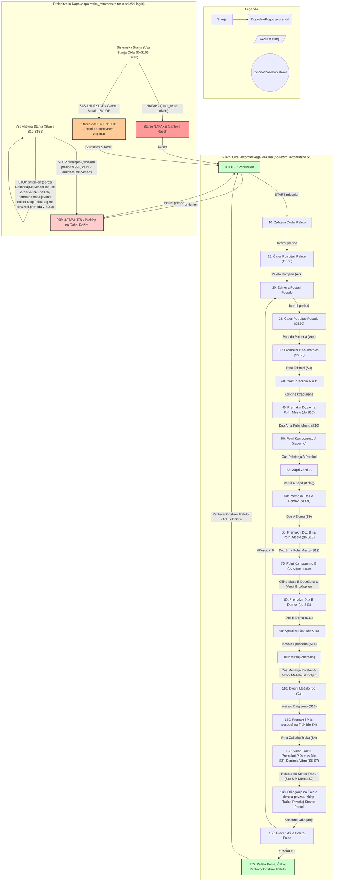
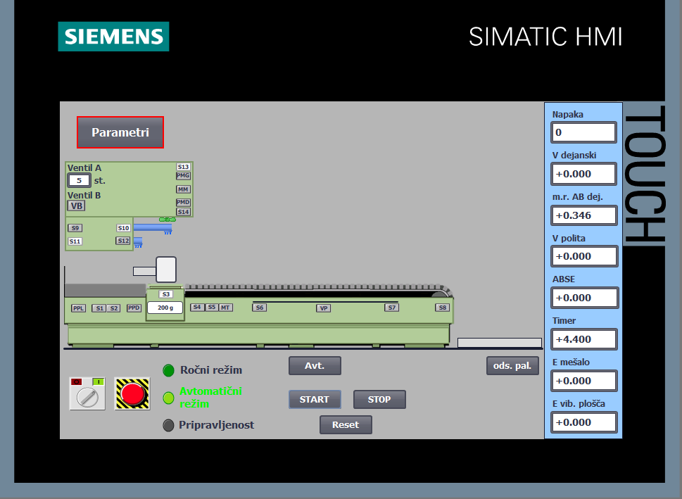
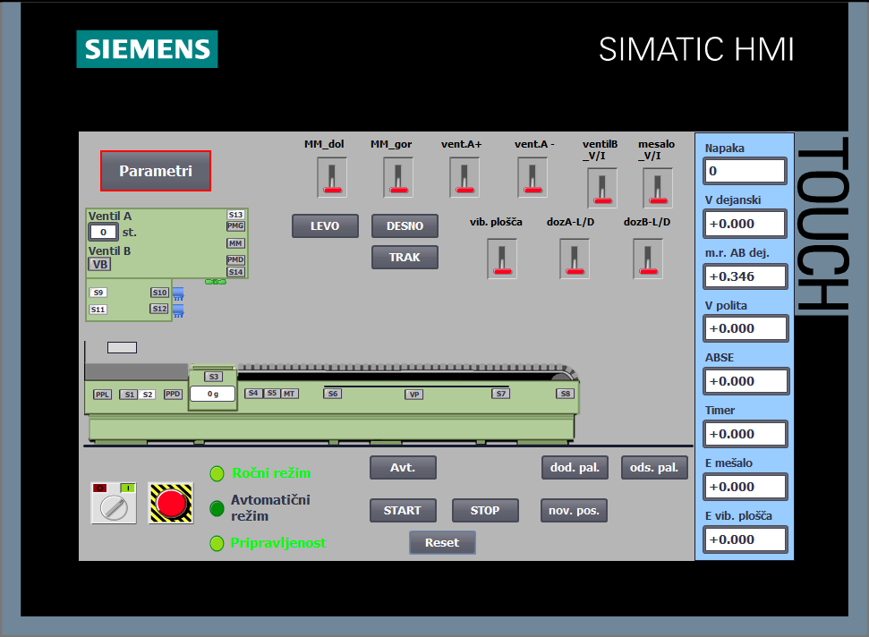

# PKS Projektna Naloga: Avtomatizirana Polnilna Linija (TIA Portal)

## Opis Projekta

Ta repozitorij vsebuje projekt za Siemens TIA Portal, razvit kot del projektne naloge pri predmetu PKS (Progralmirljivi Krmilni Sistemi). Namen projekta je avtomatizacija in vodenje polnilne linije za pripravo gradbene mase in polnjenje le-te v posode. Projekt vključuje krmilni program za PLC Siemens S7-1200 in uporabniški vmesnik za HMI panel TP700 Comfort.

Tehnološki postopek zajema naslednje korake:
1.  Postavitev prazne palete na konec linije.
2.  Postavitev prazne posode na podajalnik P.
3.  Premik posode na polnilno mesto (tehtnica).
4.  Doziranje komponente A (voda) in komponente B (agregat).
5.  Mešanje komponent.
6.  Premik polne posode na tekoči trak.
7.  Transport posode po traku preko vibracijske plošče.
8.  Odlaganje posode na paleto.

## Strojna Oprema

* **PLC:** Siemens SIMATIC S7-1200 (Specifično: S7-1214C DC/DC/DC, IP: 192.168.0.1)
* **HMI:** Siemens SIMATIC TP700 Comfort Panel (IP: 192.168.0.2)

## Programska Oprema

* Siemens TIA Portal

## Struktura Projekta (TIA Portal)

Struktura vključuje naslednje ključne komponente:

* **Organizacijski Bloki (OBs):**
    * `Main [OB1]`: Glavni ciklični program.
    * `Cyclic interrupt [OB30]`: Periodična prekinitev (100 ms) za izvajanje simulacijskega modela in časovno kritičnih nalog.
    * `Startup [OB100]`: Zagon programa in inicializacija spremenljivk.
* **Funkcijski Bloki (FBs):**
    * `FB1 FB_sim_model`: Simulacijski model tehnološkega procesa (zaščiten z geslom).
    * `FB2 IZBERI_REZIM`: Logika za izbiro med ročnim in avtomatskim režimom.
    * `FB3 rezim_avtomatsko`: Implementacija logike za avtomatski režim (vključno z avtomatom stanj).
    * `FB4 rezim_rocno` : Implementacija logike za ročni režim.
    * `FB5 Izracun_Energije`: Izračun porabe energije vibracijske plošče in mešala  [kWH].
* **Funkcije (FCs):**
    * `FC1_init`: Inicializacija (klicano iz OB100).
    * `FC2 resetiraj_aktuatorje`: Funkcija za resetiranje spremenljivk ki aktivirajo aktuatorjev.
    * `FC3 OB30_Network1` / `FC4 OB30_Network4`: prvi network v OB30 , funkcije, klicane iz OB30.
* **Podatkovni Bloki (DBs):**
    * `DB1 FB_sim_model_DB`: Instančni DB za simulacijski model (zaščiten).
    * `DB2 DB_podatki_procesa`: Parametri procesa (npr. `V_žel`, `m_posode`, `mr_AB_žel`).
    * `DB3 DB_spremenljivke`: Globalne spremenljivke za krmiljenje procesa iz HMI HMI (npr. `tipka_start`, `tipka_stop`, stanja).
    * `DB4 DB_izhodne_spremenljivke`: Izhodne spremenljivke iz procesa ki so rezultat simulacijskega teka.
    * `DB5 DB_vhodne_aktuatorjev`: Signali ki krmilijo vhode aktuatorjev iz HMI/logike.
    * `DB6 IZBERI_REZIM_DB`: Instančni DB za FB2.
    * `DB7 Izracun_Energije_DB`: Instančni DB za FB5.
    * `DB8 CHAT_GPT_ROCNO_DB` / `DB10 DB_sim_model` / `DB12 GLOBAL_Sync_Flags`: Dodatni DB-ji, za testiranje.
* **HMI Screens:** Uporabniški vmesnik na TP700 Comfort panelu za spremljanje in upravljanje procesa.

*(Opomba: Struktura temelji na priloženi sliki `image_1a81ac.png` in opisu. Imena nekaterih blokov (npr. `CHAT_GPT...`) morda odražajo razvojno fazo.)*

## Funkcionalnost

Krmilni program omogoča dva načina delovanja:

### 1. Ročni Režim (`rezim_rocno`)

* Privzeti način ob vklopu (če ni napake in ni pritisnjen E-Stop).
* Omogoča neposredno upravljanje posameznih aktuatorjev preko HMI vmesnika:
    * Postavitev/odstranitev palete in posode.
    * Premikanje podajalnikov P in M ter dozirnikov A in B.
    * Vklop/izklop ventilov A in B.
    * Vklop/izklop mešala, tekočega traku in vibracijske plošče.
* Prikaz vseh relevantnih procesnih vrednosti (volumen, masa, stanje senzorjev, napake, poraba energije...).
* Možnost vnosa parametrov (npr. `V_žel`).
* Namenjen testiranju, vzdrževanju in spoznavanju delovanja linije.

### 2. Avtomatski Režim (`rezim_avtomatsko`)

* Aktivira se iz ročnega režima preko HMI tipke, če so izpolnjeni pogoji pripravljenosti (`pripravljenost` = TRUE).
* Po pritisku tipke `START` izvede celoten cikel polnjenja za 6 posod:
    1.  Avtomatska postavitev palete in prve posode.
    2.  Premik posode na tehtnico.
    3.  Izračun in natančno doziranje komponent A in B glede na `V_žel` in `mr_AB_žel`.
    4.  Avtomatsko mešanje (`t_žel_meš`).
    5.  Premik polne posode na trak.
    6.  Avtomatski vklop traku in transport.
    7.  Aktivacija vibracijske plošče za zahtevan čas (`t_žel_vib`), odvisno od mase.
    8.  Odlaganje posode na paleto.
    9.  Ponavljanje korakov 2-8 za naslednjih 5 posod.
* Po napolnitvi 6 posod se cikel ustavi in čaka na odstranitev polne palete (tipka `odstrani_paleto`).
* Možnost prekinitve cikla s tipko `STOP` (proces se zaključi za trenutno posodo) ali takojšnje zaustavitve z `ZASILNI IZKLOP` ali izklopom glavnega stikala.
* Prikaz stanja cikla, števca posod, skupnega časa, odstopanj volumna (`ABSE`), doseženega razmerja (`mr_AB_dej`), prelitega volumna (`V_polit`) in napak.
* Možnost vnosa `V_žel` in `mr_AB_žel`.

## Diagram Stanj (Avtomatski Režim)

Logika avtomatskega režima je implementirana kot sekvenčni stroj v bloku `FB3 rezim_avtomatsko`. Stanja predstavljajo posamezne korake tehnološkega procesa.

